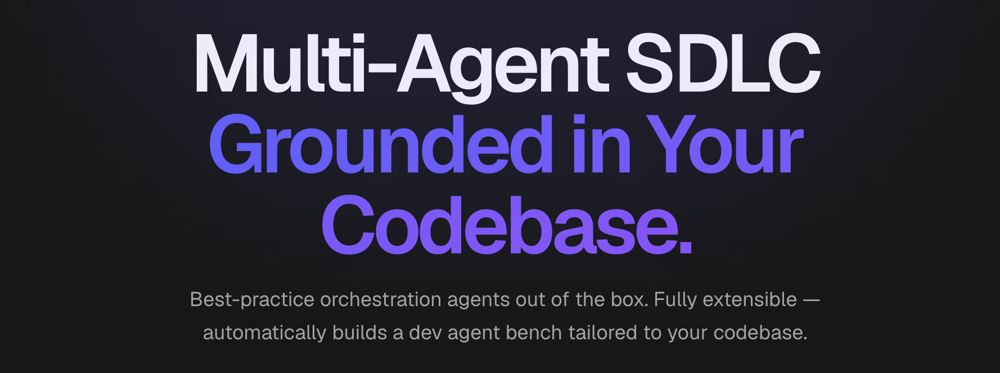

# ClosedLoop.AI Claude Plugins

<div>
  
  
  
</div>

<br/>



ClosedLoop is an AI platform that brings the speed of individual AI-driven development to the full software development team. We're offering our agents as open sourced Claude Code plugins because we just couldn't keep this a secret for ourselves — check out our agents for planning, code reviews, judging quality and more that outperform Opus 4.6 and Sonnet 4.5 out of the box.

**Bootstrap. Plan. Code. Ship.** It's that simple.

LLMs are great at non-deterministic content generation — horrible at being repeatably correct.

That's why we took Claude Code and extended it with a lightweight multi-agent orchestration workflow paradigm that works for us; modeling how we collaborate as a team.

Optimized for efficiency & correctness to produce code that lands without the churn; it's grounded in your codebase and outperforms Opus 4.6 out of the box at half the cost.

What's more impactful is that it allowed our team of engineers to shift left; reviewing and approving sprints-worth of work scope in documented implementation plans and generating the code while we slept.

Tickets become Tasks. Epics become Features. Sections of your quarterly roadmap land in a few PRs.

Multi-repository, adaptive self-learning, & artifact-bound phased workflow gates that loop until correct.

**Close the Loop on your SDLC with the same tools that made us 400% faster today.**

## Plugins

| Plugin | Description |
|--------|-------------|
| **bootstrap** | Project bootstrapping and initial setup |
| **code** | Code generation, implementation planning, and iterative development loop |
| **code-review** | Automated code review with inline GitHub PR comments |
| **judges** | LLM-as-judge evaluators for plan and code quality |
| **platform** | Claude Code expert guidance, prompt engineering, and artifact management |
| **self-learning** | Pattern capture and organizational knowledge sharing |

## Prerequisites

- Python 3.11+ (3.13 recommended)
- [jq](https://jqlang.github.io/jq/)
- [Claude Code](https://claude.ai/code)

## Quick Start

```bash
# Install a plugin from the marketplace
claude /plugin marketplace install closedloop

# Or install from source for development
git clone git@github.com:closedloop-ai/claude-plugins.git
cd claude-plugins
git config core.hooksPath .githooks

# Bootstrap.
claude /bootstrap:start

# Plan. Code.
claude /code:start --prd requirements.md
```

## Benchmarks


## Contributing

See [CONTRIBUTING.md](CONTRIBUTING.md) for development setup, workflow, and code style guidelines.

## Disclaimer
Our claude code plugins are a low-key engineering preview of the agents that run the larger ClosedLoop platform. These agents should be used for testing in trusted environments.

## License

[Apache License 2.0](LICENSE)
