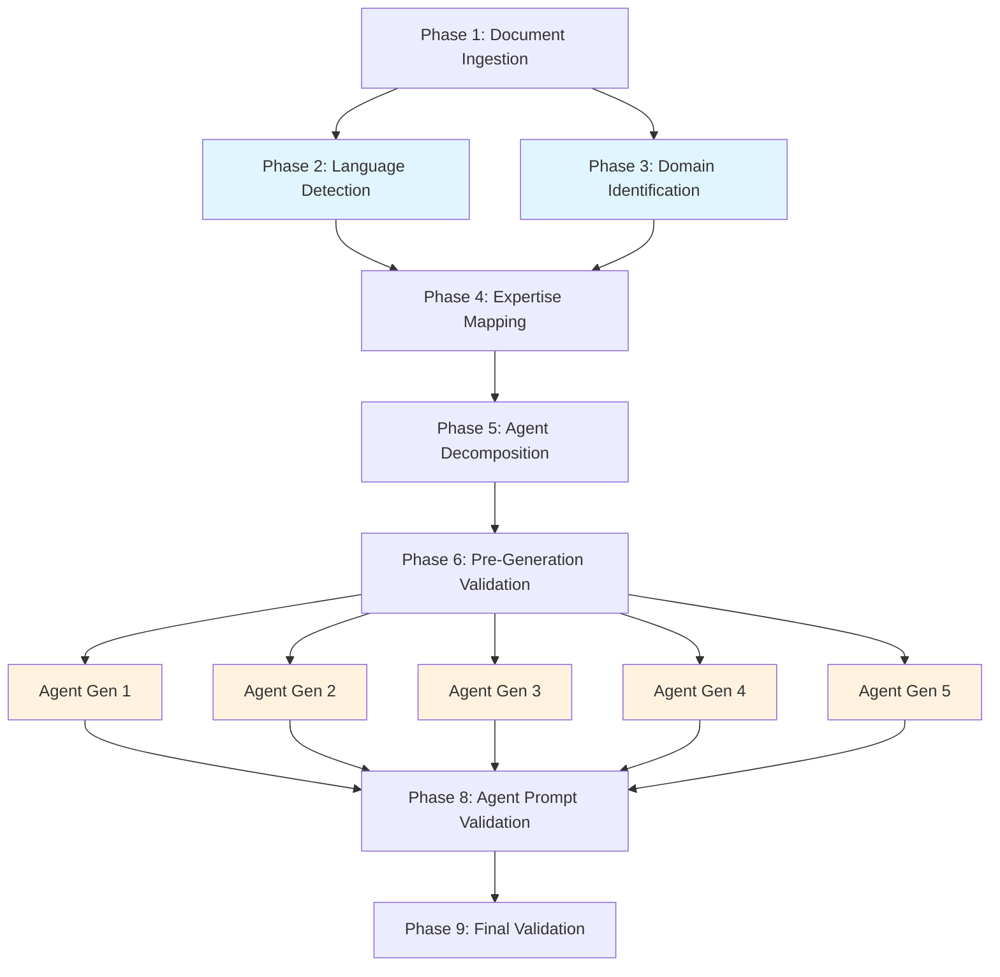

# Bootstrap Plugin

Analyzes a codebase and automatically generates a custom suite of project-specific domain expert agents tailored to the project's technology stack and architecture.

## Overview

The Bootstrap plugin is a meta-orchestrator for the ClosedLoop agent ecosystem. It reads your project's documentation and source tree, identifies the domains of work your project involves (API backend, data persistence, frontend, mobile, etc.), and generates purpose-built Claude agent prompt files configured for your specific tech stack.

The key design principle is **domain identification over framework detection**. Rather than using fragile heuristics to detect specific libraries, Bootstrap reads your documentation as the source of truth and identifies the *kinds of work* your project requires. This produces agents that understand your actual architecture, constraints, and conventions.

## Key Features

- Reads CLAUDE.md, README, architecture docs, and package manifests to extract project context
- Detects programming languages via file counting (no heuristics)
- Identifies work domains: API backend, data persistence, caching, authentication, frontend, mobile, analytics, and more
- Maps domains to expert agent roles, then intelligently decomposes complex agents into focused specialists
- Generates complete agent prompt files using LLM intelligence (no static templates)
- Validates all generated prompts before writing them out
- Supports incremental updates via `--update` mode to regenerate only outdated agents
- Generates `critic-gates.json` configuration for use with the `code` workflow

## Architecture Overview

Bootstrap runs through **8 sequential phases**. Phases 2 and 3 (language detection and domain identification) run in parallel. Phase 6 (agent generation) fans out across all agents with up to 5 agents generated in parallel.



The workflow definition is in `commands/agent-bootstrap.json`, which specifies the agent for each phase, its inputs (`requires`), outputs (`produces`), and parallelism settings.

## Agents

### project-doc-ingestor

Reads and synthesizes project documentation to extract context used by all downstream phases. Processes files in priority order: CLAUDE.md, README.md, ARCHITECTURE.md, docs/architecture/, CONTRIBUTING.md, and package manifests (package.json, pyproject.toml, Cargo.toml, etc.).

Produces: `discovery/project-context.md`

### language-detector

Counts source files by extension to determine the language distribution of the codebase. Excludes build artifacts, node_modules, and other generated directories. Classifies languages as primary (>=30%), secondary (10-29%), or minor (<10%).

Produces: `discovery/languages.json` (validated against `languages.schema.json`)

### domain-identifier

Identifies domains of work present in the project by analyzing the project context document and performing a shallow code scan. Assesses each detected domain's complexity (low/medium/high) and lists the technologies involved.

Recognized domains include: `web-frontend`, `mobile-native`, `api-backend`, `data-persistence`, `caching`, `real-time-communication`, `authentication`, `authorization`, `analytics`, `testing`, `build-deployment`, `monitoring-observability`.

Produces: `discovery/domains.json` (validated against `domains.schema.json`)

### expertise-mapper

Maps detected languages and domains to candidate expert agent roles. Always includes two required agents (`test-strategist`, `security-privacy`). Adds language experts for any language at >=10% of the codebase, and domain experts for any domain with at least medium confidence.

Does **not** include universal agents (prd-analyst, feature-locator, plan-writer, plan-stager, plan-verifier, agent-trainer) since those already exist in the core code workflow.

Produces: `synthesis/expert-agents.json` (validated against `expert-agents.schema.json`)

### agent-decomposer

Analyzes candidate agents and decides whether each should be kept as a single agent or split into focused specialists. For example, a `frontend-architect` agent on a cross-platform project might decompose into `react-component-architect`, `state-management-architect`, and `cross-platform-routing-architect`.

Decomposition is driven by domain complexity (high complexity favors decomposition), technology breadth (multiple databases, REST + GraphQL), and whether splitting would meaningfully improve output quality.

Also generates `critic-gates.json`, which defines which agents act as critics in the `code` workflow. Required agents (`test-strategist`, `security-privacy`) and language experts are always base critics. Domain agents are mapped to module patterns so they are only invoked when relevant.

Produces: `synthesis/decomposed-agents.json`, `.claude/settings/critic-gates.json`

### generation-validator

Validates the decomposed agent list before the expensive generation phase begins. Checks for:

- Specification completeness (all required fields present)
- Duplicate agent names
- Required agents present (`test-strategist`, `security-privacy`)
- Universal agents not in the generation list
- Artifact path validity (no absolute paths, no `../` traversal)
- Domain coverage (at least 3 agents total)
- Color assignment feasibility

Produces: `synthesis/generation-validation.json`

### agent-prompt-generator

Generates one complete agent prompt file per invocation. This agent uses LLM intelligence to write appropriate prompts from scratch based on the agent specification and project context—no static templates.

For architecture agents (those ending in `-architect`, `-expert`, `-specialist`), the generated prompts include a mandatory two-phase relevance check structure: a quick 30-second relevance check (Phase 1), followed by focused implementation analysis only when relevant (Phase 2). This prevents architecture agents from doing unnecessary work on features outside their domain.

For non-architecture agents (test-strategist, security-privacy, etc.), standard prompts are generated with full Role, Inputs, Task, Output Format, and Success Criteria sections.

Colors are assigned by domain: database agents get blue, API agents get green, frontend/state gets purple, mobile gets cyan, security gets red, testing gets yellow, performance gets orange, analytics/monitoring gets pink.

Produces: `.claude/agents/<agent-name>.md`, `.closedloop-ai/bootstrap-metadata.json`

### agent-prompt-validator

Validates all generated agent prompt files listed in `.closedloop-ai/bootstrap-metadata.json`. Performs these checks in order:

1. **YAML header** (blocking) - File must start with `---`, include all required fields (name, description, model, color), and use only approved colors
2. **Structure** (blocking) - Required sections must be present and non-empty
3. **Artifact contracts** (warning) - Documented inputs/outputs should match `decomposed-agents.json`
4. **Content budget** (warning) - Context budgets should be within recommended limits
5. **Anti-pattern detection** (warning) - Circular dependencies, overly broad scope, missing project context
6. **File quality** (blocking if >150KB) - File size and Markdown validity

Produces: `synthesis/agent-validation.json`

### bootstrap-validator

Performs final validation of the complete bootstrap output: validates each artifact against its JSON schema, confirms all generated agents exist with valid prompts, and verifies critic-mode wiring is correct for agents that participate as critics.

Produces: `validation-report.json`, `bootstrap-report.md`

## Command

### `/agent-bootstrap`

```
/agent-bootstrap [options]
```

**Core options:**

| Option | Description | Default |
|---|---|---|
| `--target-command <name>` | Target command to generate agents for | `code` |
| `--depth quick\|medium\|deep` | Discovery thoroughness | `medium` |
| `--focus <area>` | Constrain to: frontend, backend, infra, mobile, web | (all) |
| `--output-dir <path>` | Where to write generated agents | `.claude/agents/` |

**Execution modes:**

| Option | Description |
|---|---|
| `--dry-run` | Preview what would be generated without writing files |
| `--interactive` | Ask clarifying questions during discovery |
| `--update` | Regenerate outdated agents based on project changes |
| `--minimal` | Generate only required agents (test-strategist, security-privacy) |
| `--enhance` | Run full analysis and generate comprehensive agent suite |
| `--add-domain <domain>` | Add agents for a specific domain |

**Conflict resolution (`--strategy`):**

| Strategy | Behavior |
|---|---|
| `backup` (default) | Back up existing files to `backup-<timestamp>/` before overwriting |
| `skip` | Skip agents that already have a file |
| `overwrite` | Replace all agents unconditionally |
| `interactive` | Prompt for each conflicting agent |

## Schemas

| Schema | Used by | Validates |
|---|---|---|
| `languages.schema.json` | language-detector | `discovery/languages.json` output |
| `domains.schema.json` | domain-identifier | `discovery/domains.json` output |
| `expert-agents.schema.json` | expertise-mapper, agent-decomposer | `synthesis/expert-agents.json` |
| `decomposed-agents.schema.json` | agent-decomposer, generation-validator, agent-prompt-validator | `synthesis/decomposed-agents.json` |
| `bootstrap-metadata.schema.json` | agent-prompt-generator, agent-prompt-validator | `.closedloop-ai/bootstrap-metadata.json` |
| `agent-validation.schema.json` | bootstrap-validator | `synthesis/agent-validation.json` |

## Output Files

All working files are written to `.closedloop-ai/bootstrap/<timestamp>/` (referred to as `$RUN` in agent prompts):

```
$RUN/
  discovery/
    project-context.md
    languages.json
    domains.json
  synthesis/
    expert-agents.json
    decomposed-agents.json
    generation-validation.json
    agent-validation.json
  validation-report.json
  bootstrap-report.md
  open-questions.md          (if ambiguities were detected)
```

Durable outputs written outside the run directory:

```
.claude/agents/
  <agent-name>.md            (one file per generated agent)
.closedloop-ai/
  bootstrap-metadata.json    (tracks all generated agents for --update mode)
.claude/settings/
  critic-gates.json          (critic selection rules for the code workflow)
```

## Usage

### Basic bootstrap

```bash
/agent-bootstrap
```

Analyzes the codebase at medium depth and generates all appropriate agents.

### Preview without writing

```bash
/agent-bootstrap --dry-run
```

### Update after codebase changes

```bash
/agent-bootstrap --update
```

Uses SHA-256 hashes of `project-context.md` stored in `.closedloop-ai/bootstrap-metadata.json` to detect which agents need regeneration.

### Minimal required agents only

```bash
/agent-bootstrap --minimal
```

Generates only `test-strategist` and `security-privacy`.

### Add a specific domain

```bash
/agent-bootstrap --add-domain data-persistence
```

### Deep analysis for large codebases

```bash
/agent-bootstrap --depth deep
```

Also detects language variants (e.g., TypeScript strict mode) and checks for language-specific tooling.

### Focus on one area

```bash
/agent-bootstrap --focus backend
```

## After Bootstrap Completes

1. Review generated agents in `.claude/agents/`
2. Check `bootstrap-report.md` for a summary and any warnings
3. Answer `open-questions.md` if present
4. Use the generated agents with: `/code --prd <your-prd.md>`

## Universal Agents (Not Generated)

Bootstrap assumes these core agents already exist and never generates them:

- `prd-analyst` - PRD intake and requirements extraction
- `feature-locator` - Maps PRD requirements to codebase locations
- `plan-writer` - Final plan synthesis
- `plan-stager` - Stage planning
- `plan-verifier` - Traceability validation
- `agent-trainer` - Agent learning and improvement

## Error Handling

**Fatal errors** halt bootstrap immediately:

- No documentation files found (no CLAUDE.md or README.md)
- Invalid agent specifications after decomposition
- Pre-generation validation failures (duplicate names, missing required agents)

**Recoverable errors** allow bootstrap to continue in degraded mode:

- Partial domain detection: generates language experts only
- Some agent generation failed: continues if >=80% succeed (configurable via `min_success_ratio`)
- Validation warnings: reported in `bootstrap-report.md` but do not block

**Retryable errors** use exponential backoff (1s base, 8s max, with jitter):

- File read errors
- LLM timeouts during generation
- Each agent gets up to 2 generation attempts
