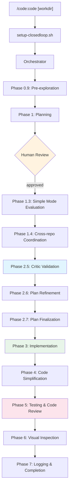

# code Plugin

The `code` plugin implements **ClosedLoop**, an autonomous software development framework that orchestrates Claude agents through a structured, multi-phase workflow. Given a requirements document (PRD), ClosedLoop plans, implements, tests, and validates code changes across one or more repositories — iterating until the work is complete.

The plugin provides the orchestrator prompt, all specialized subagents, a hook system for session management and learning capture, skills for deterministic caching and validation, schemas for data contracts, and Python utilities used throughout the workflow.

---

## Key Features

- **Plan-first workflow**: Generates a structured `plan.json` from a PRD, pauses for human review, then proceeds to implementation
- **Multi-phase orchestration**: Sequenced phases covering pre-exploration, planning, critic review, implementation, code review, visual QA, and validation
- **Loop agents**: Key agents (plan-draft-writer, implementation-subagent, etc.) self-validate and iterate until quality gates pass
- **Caching layer**: Skills for critic, build, and cross-repo caches eliminate redundant expensive agent calls between iterations
- **Self-learning system**: Agents capture learnings into pending JSON files; hooks inject relevant past patterns into new agent contexts
- **Cross-repo coordination**: Discovers peer repositories, identifies missing capabilities, and generates cross-repo PRDs
- **Visual QA**: Playwright-based browser automation agent validates UI changes against documented requirements
- **Plan amendment**: The `/code:amend-plan` command supports natural conversation to modify an approved plan after implementation has started

---

## Architecture Overview



The orchestrator never reads project files directly. All file operations are delegated to subagents, keeping the orchestrator's context lean for coordination work.

State is maintained in `$CLOSEDLOOP_WORKDIR/state.json` at each phase transition so external UIs can display progress.

---

## Commands

### `/code:code`

**Description:** Begin a ClosedLoop coding session.

**Usage:**
```
/code:code [working-directory] [--prompt <name>] [--prd <requirements-file>]
```

- `working-directory`: Path to the work directory containing the PRD (defaults to current directory)
- `--prompt <name>`: Select an alternate orchestrator prompt from `prompts/` (defaults to `prompt`)
- `--prd <file>`: Explicitly specify the requirements file (auto-detected if omitted)

**What it does:**
1. Runs `setup-closedloop.sh` to write config and establish the session
2. Loads the orchestrator prompt specified by `CLOSEDLOOP_PROMPT_FILE`
3. The orchestrator coordinates all phases until completion or a hard stop requiring user input

The command runs inside a ClosedLoop loop — the external loop runner (`run-loop.sh`) relaunches it with fresh context on each iteration until `<promise>COMPLETE</promise>` is output.

### `/code:amend-plan`

**Description:** Discuss and apply amendments to a `plan.json` implementation plan.

**Usage:**
```
/code:amend-plan --workdir [path] --message "<text>" [--state-file [path]]
```

- `--workdir <path>`: Work directory containing `plan.json` (defaults to `$CLOSEDLOOP_WORKDIR` or `.claude/work`)
- `--message <text>`: The user's message (required)
- `--state-file <path>`: Path to the amend session state file (defaults to `{workdir}/amend-session.json`)

**What it does:**

Supports four intent types:
- **Directives**: "don't remove X", "change Y to Z" — applies changes after safety analysis
- **Questions**: "what do you think about..." — discusses without making changes
- **Confirmations**: "yes", "go ahead" — applies previously discussed pending changes
- **Unstructured input**: Meeting notes or Slack threads — delegates to `amend-extractor` agent to extract structured changes

Conversation state is persisted across GitHub workflow runs via `amend_state.py`. After applying changes, records an amendment entry in `plan.json` and deletes the session file.

### `/code:cancel-code`

**Description:** Cancel an active ClosedLoop loop.

Checks for `.claude/closedloop-loop.local.md`, reads the current iteration, removes the file, and reports the cancellation. Hidden from the slash command picker.

---

## Agents

### Planning Agents

**`plan-draft-writer`** (model: opus)
Creates high-level implementation plan drafts from PRDs. Investigates the codebase, extracts requirements, and produces a `plan.json` and `plan.md` for human review. Enforces strict scope discipline — every task must trace to a PRD section. Produces no code snippets in drafts. Runs as a loop agent (max 10 iterations) validated by `validate-plan.sh`.

**`plan-writer`** (model: sonnet)
Modifies existing plans in three modes: **Merge Mode** (reconciles critic feedback), **Finalize Mode** (enriches tasks with implementation details, code patterns, and integration points), and **Addressed Gaps** (converts resolved gaps into concrete tasks). Does not create plans from scratch. Runs as a loop agent (max 5 iterations).

**`plan-validator`** (model: sonnet)
Validates `plan.json` structure: JSON parsing, schema validation, task checkbox format, required section presence, JSON-to-markdown sync, and semantic consistency (storage/query alignment, task-architecture contradictions). Returns structured JSON for orchestrator consumption. Runs as a loop agent; only required for semantic checks after plan modification — structural checks use the `plan-validate` skill instead.

**`plan-evaluator`** (model: sonnet)
Evaluates whether a plan qualifies for **simple mode** (skipping critics, cross-repo coordination, and finalization) using six threshold signals: PRD word count, acceptance criteria count, task count, open question count, forbidden complexity terms, and cross-repo keywords. If not simple, selects which critic agents to run based on `critic-gates.json` configuration.

**`answered-questions-subagent`** (model: haiku)
Processes the `answeredQuestions` array from `plan.json` and incorporates answers into the relevant task descriptions. Removes processed questions from both the structured array and the markdown content field.

### Implementation Agents

**`pre-explorer`** (model: haiku)
Performs targeted codebase exploration before plan drafting. Produces three output files — `requirements-extract.json`, `code-map.json`, and `investigation-log.md` — so the planning agent can skip mechanical discovery and focus on architecture.

**`verification-subagent`** (model: sonnet)
Checks whether a plan task has already been implemented. Reads relevant source files and verifies every specific requirement. Returns `VERIFIED` or `NOT_IMPLEMENTED` with a list of missing requirements and relevant file paths for the implementation agent.

**`implementation-subagent`** (model: sonnet)
Implements missing requirements for a single plan task. Reads source files, checks for existing utilities before creating new ones, and passes four self-verification gates: re-reading modified files, per-requirement evidence, integration checks, and static analysis. Runs as a loop agent (max 4 iterations). Appends to `visual-requirements.md` if UI changes are made.

**`build-validator`** (model: haiku)
Discovers and runs project-specific validation commands (test, lint, typecheck, build, pre-commit hooks) across any project type (Node.js, Python, Rust, Go, Android, Makefile). Attempts auto-fix for lint failures. Caches discovered commands as learnings. Returns `VALIDATION_PASSED`, `VALIDATION_FAILED`, or `NO_VALIDATION`.

**`code-reviewer`** (model: sonnet)
Reviews code changes for security vulnerabilities, correctness bugs, type safety issues, performance problems, and DRY violations. Operates on git diffs, applying a strict evidence standard: Critical/High findings require concrete proof, not speculation. Checks multi-tenant authorization on data-access endpoints. Runs as a loop agent (max 5 iterations) — only exits when no Critical/High findings remain.

### Cross-Repo Agents

**`cross-repo-coordinator`** (model: haiku)
Discovers peer repositories via workspace configuration or sibling directory scanning. Identifies capabilities needed from each peer based on plan task content. Writes `.cross-repo-needs.json` and returns a `CAPABILITIES_LIST` for the orchestrator to iterate over.

**`generic-discovery`** (model: haiku)
Searches a peer repository to verify whether a specific capability exists (endpoint, model, component, service). Reads the peer's `CLAUDE.md` for directory conventions before searching. Caches results to `.discovery-cache/{peer-name}.json`.

**`repo-coordinator`** (model: haiku)
Discovers peer repositories and maps them to the appropriate discovery agent type (e.g., `code:backend-discovery`, `code:generic-discovery`).

**`cross-repo-prd-writer`** (model: sonnet)
Generates PRD documents for capabilities that need to be built in peer repositories. Reads discovery cache results, identifies missing capabilities, and creates `cross-repo-prd-{peer-name}.md` files. Updates `plan.json` with `[CROSS-REPO: {peer}]` tags.

**`api-spec-writer`** (model: sonnet)
Generates `api-requirements.md` from an approved plan. Extracts tasks requiring backend APIs and produces endpoint specifications with request/response TypeScript interfaces, error codes, auth requirements, and traceability to task IDs and acceptance criteria.

### Support Agents

**`visual-qa-subagent`** (model: sonnet)
Performs visual QA using Playwright browser automation. Reads test steps exclusively from `visual-requirements.md` — never from source code. Returns `SUCCESS`, `FAILURE`, `AUTH_REQUIRED`, `BLOCKED`, or `INCOMPLETE_DOCS`. Maintains `visual-qa-memory.md` throughout the session.

**`dev-environment`** (model: haiku)
Introspects workspace repositories to determine how to start development servers. Reads `.workspace-repos.json` from cross-repo-coordinator and produces `.dev-environment.json` with start commands and health checks for each target (web, iOS, Android, API).

**`learning-capture`** (model: sonnet)
Processes pending learning JSON files from `.learnings/pending/`. Classifies each as `closedloop` (tooling improvements) or `organization` (project-specific patterns), assigns categories (mistake, pattern, convention, insight), and writes structured session output.

**`amend-extractor`** (model: sonnet)
Extracts actionable plan amendments from unstructured input (meeting notes, Slack threads, email). Returns structured JSON with `extracted_changes`, `unclear_items`, and `no_action_items`. Used by the `amend-plan` command when input cannot be classified as a directive, question, or confirmation.

**`code-review-worker`** / **`code-review-guidelines`**
Supporting agents for the code review workflow. `code-review-guidelines` provides language-specific review patterns and edge case guidance. `code-review-worker` handles individual file review tasks within the reviewer workflow.

---

## Skills

Skills are reusable, invocable units of functionality available to orchestrators and agents via the `Skill` tool.

### `plan-validate`

Deterministic `plan.json` validation via Python script. Replaces most `plan-validator` agent calls for structural checks. Validates JSON parsing, schema fields, task checkbox format (`- [ ]` / `- [x]`), all 10 required section headers, and JSON-to-markdown sync. Returns the same output format as the plan-validator agent. Invoked with `Skill(skill="code:plan-validate")`.

### `critic-cache`

Checks whether critic reviews are still valid before Phase 2.5 by hashing `plan.json` and `critic-gates.json`. Returns `CRITIC_CACHE_HIT` (skip critics, existing reviews are valid) or `CRITIC_CACHE_MISS` (run critics). Prevents redundant Sonnet agent launches when the plan has not changed since the last critic run.

### `build-status-cache`

Skips the Phase 7 final build check when no code has changed since Phase 5 build passed. Hashes `git diff HEAD` output, compares to the hash stored after Phase 5, and returns `BUILD_CACHE_HIT` or `BUILD_CACHE_MISS`. Invoked with `Skill(skill="code:build-status-cache")`.

### `cross-repo-cache`

Checks whether cross-repo coordinator results can be reused by comparing peer repository git HEAD hashes to stored hashes. Returns `CROSS_REPO_CACHE_HIT` with the cached status or `CROSS_REPO_CACHE_MISS`. Prevents redundant cross-repo discovery when peers have not changed.

### `plan-structure`

Provides reusable guidance for plan creation and updates. When activated, agents must read the `resources/playbook.md` (conventions and quality bar) and `resources/plan_template.md` (required structure and sections). Used by `plan-draft-writer` and `plan-writer`.

### `plan-editing-conventions`

Documents conventions for editing `plan.json` content fields — task format, structured array sync rules, complexity labeling (S/M/L), and the requirement to use `\n` escape sequences rather than literal newlines in JSON strings. Used by the `amend-plan` command.

### `extract-plan-md`

Syncs `plan.md` with `plan.json` after any edit. Runs the `extract.py` script which reads the `content` field from `plan.json` and writes it to `plan.md` in the same directory. Must be used after every `plan.json` modification.

### `closedloop-env`

Provides ClosedLoop environment paths to agents by reading `.closedloop-ai/env`. Returns `CLOSEDLOOP_WORKDIR`, `CLAUDE_PLUGIN_ROOT`, `CLOSEDLOOP_PRD_FILE`, and `CLOSEDLOOP_MAX_ITERATIONS`. Used by agents that need to construct file paths dynamically.

### `prd-creator`

Conversational PRD drafting skill for PMs. Supports four workflow modes: **Discovery** (guided problem/persona/metrics exploration), **Draft** (generates PRD from `assets/prd-template.md`), **Story Expansion** (adds Given/When/Then acceptance criteria to user stories), and **Epic Generation** (groups stories into sprint-sized epics). Uses consistent ID conventions (US-###, AC-###.#, Q-###) for traceability through the Symphony pipeline. Includes healthcare-specific story patterns and event instrumentation references. Invoked automatically when users mention PRDs, feature ideas, sprint planning, or story breakdowns.

### `find-plugin-file`

Dynamically locates files within the Claude Code plugins cache directory (`~/.claude/plugins/cache/closedloop-ai/`). Resolves the latest plugin version automatically. Used by commands that need to reference plugin tool scripts without hardcoding version-specific paths.

### `iterative-retrieval`

A 4-phase protocol for orchestrators to refine subagent queries through follow-up questions. Phases: Initial Dispatch, Sufficiency Evaluation (4-question checklist), Refinement Request (resume with targeted follow-ups), and Loop (up to 3 cycles). Used when initial subagent responses may miss important adjacent context.

---

## Hooks

Hooks are shell scripts that fire at Claude Code lifecycle events. Registered in `hooks/hooks.json`.

### `session-start-hook.sh` (SessionStart)

Creates a PID-to-session-ID mapping file at `.closedloop-ai/pid-{PPID}.session`. This mapping allows `setup-closedloop.sh` — which runs as a child process — to discover the session ID by walking up the process tree. Essential for associating a work directory with a session.

### `session-end-hook.sh` (SessionEnd)

Cleans up session-level artifacts: removes the session workdir mapping file, cleans up stale PID-to-session mappings (processes that no longer exist), removes session-specific files older than 24 hours, and cleans up orphaned `.agent-types` directories.

### `subagent-start-hook.sh` (SubagentStart)

Runs when any subagent starts. Performs three tasks:

1. **Loop agent state creation**: If the agent type appears in `loop-agents.json`, creates the initial state file in `{WORKDIR}/.closedloop/` if it does not already exist.
2. **Agent type tracking**: Writes the agent type, short name, and start timestamp to `.agent-types/{agent_id}` so the stop hook can track timing and type.
3. **Learning injection**: Reads `~/.closedloop-ai/learnings/org-patterns.toon`, filters patterns matching the agent's name, sorts by category priority (mistake > convention > pattern > insight) and confidence, and injects up to 15 patterns into the agent's context via `additionalContext`. Also injects environment variables (`CLOSEDLOOP_WORKDIR`, `CLAUDE_PLUGIN_ROOT`, etc.) into every agent's context.

### `subagent-stop-hook.sh` (SubagentStop)

Runs when any subagent exits. Performs:

1. **Learning acknowledgment verification**: Checks whether the agent output contains `LEARNINGS_ACKNOWLEDGED`. For agents listed in `loop-agents.json` learning_agents, blocks the agent (forces it to retry) if acknowledgment is missing, up to `max_retries` times.
2. **Learning capture enforcement**: For learning agents, checks whether a pending learning file was written. Blocks the agent with `LEARNING CAPTURE REQUIRED` if not, up to `max_retries` times.
3. **Outcome logging**: Records which injected patterns were applied or merely injected to `outcomes.log` for success rate computation.
4. **Performance instrumentation**: Computes agent wall-clock duration from start timestamp and appends a timing event to `perf.jsonl`.

### `loop-stop-hook.sh` (SubagentStop, runs before subagent-stop-hook)

Implements the validation loop for agents registered in `loop-agents.json`. When an agent exits:

1. Reads the loop state file (`{WORKDIR}/.closedloop/{state_file_suffix}`)
2. Checks whether the agent output contains the expected completion promise (e.g., `<promise>PLAN_VALIDATED</promise>`)
3. If the promise is present, optionally runs a validation script (e.g., `validate-plan.sh`)
4. If validation passes, allows the agent to exit (returns nothing)
5. If validation fails or the promise is absent, increments the iteration counter and blocks the agent with feedback to continue

### `pretooluse-hook.sh` (PreToolUse, matches Read/Bash/Write/Edit)

Injects tool-specific learnings just before tool execution. Filters `org-patterns.toon` by tool type (Bash patterns get build/test tags; Write/Edit patterns get language-specific tags based on file extension). Injects up to 10 matching patterns as `additionalContext`. Also auto-allows tool calls targeting `.closedloop-ai/` workspace paths without prompting.

### `validate-plan.sh` (validation script, not a hook directly)

Used by `loop-stop-hook.sh` as the validation script for `plan-draft-writer` and `plan-writer` loop agents. Checks: plan.json exists, contains a valid `content` field, has an `## Open Questions` section, uses checkbox task format, has no TODO/TBD placeholders, and warns on unjustified new file creation or code duplication patterns. Outputs `VALIDATION: PASS` or `VALIDATION: FAIL` with issue details.

---

## Schemas

### `plan-schema.json`

Defines the structure of `plan.json` implementation plans.

**Top-level required fields:**
- `content` (string): Full markdown plan with escaped newlines
- `acceptanceCriteria` (array): Items with `id` (AC-###), `criterion`, `source`
- `pendingTasks` (array): Tasks not yet completed, items with `id` (T-#.#), `description`, `acceptanceCriteria`
- `completedTasks` (array): Tasks marked complete (same item structure)
- `openQuestions` (array): Items with `id` (Q-###), `question`, optional `recommendedAnswer` and `blockingTask`
- `answeredQuestions` (array): Items with `id`, `question`, `answer`
- `gaps` (array): Items with `id` (GAP-###), `description`, `addressed` (boolean), optional `resolution`

**Optional fields:**
- `manualTasks` (array): Tasks requiring human action, same structure as pendingTasks
- `amendments` (array): History of applied plan amendments with `timestamp`, `changes`, and `conversation`

### `review-delta.schema.json`

Defines the structure of critic review output files (`reviews/*.review.json`). Each review contains `items` or `review_items` arrays where each finding has an `anchor_id`, `severity` (blocking/major/minor), `rationale`, optional `proposed_change` (with `op`, `target`, `path`, `value`), `ac_refs`, `files`, and `tags`.

### `code-map.schema.json`

Defines the structure of `code-map.json` produced by the `pre-explorer` agent. Required fields: `feature`, `scope`, `files` (array of `{path, role, confidence, neighbors}`), `modules`, `platforms`, `parity_risk` (boolean), `parity_reasons`. File roles: `route`, `screen`, `component`, `hook`, `service`, `util`, `test`, `config`.

---

## Scripts

### `setup-closedloop.sh`

Initializes a ClosedLoop session. Parses arguments (`--prd`, `--max-iterations`, `--prompt`, positional workdir), auto-detects the PRD file by checking common patterns (`prd.md`, `prd.pdf`, `requirements.md`, etc.), establishes the session-to-workdir mapping, validates the prompt name, and writes `{WORKDIR}/.closedloop/config.env` with all environment variables.

### `run-loop.sh`

External loop runner. Launches `claude -p` in a loop, maintaining state in `.claude/closedloop-loop.local.md`. Integrates with the self-learning system. Tracks run ID, start SHA, iteration count, and progress log. Continues until the orchestrator outputs `<promise>COMPLETE</promise>` or max iterations are reached.

### `setup-loop.sh`

Sets up a ClosedLoop loop with initial configuration and state.

### `discover-repos.sh`

Discovers peer repositories for cross-repo orchestration by checking the `CLAUDE_WORKSPACE_REPOS` environment variable, scanning sibling directories for `.claude/.repo-identity.json` files, or detecting monorepo structures. Returns JSON describing the current repo and all discovered peers.

### `install-dependencies.sh`

Installs required Python dependencies for the plugin's tools.

### `loop-agents.json`

Configuration file (not a script) defining which agents participate in the validation loop. Each entry specifies: `validation_script`, `max_iterations`, `promise` (expected completion string), `state_file_suffix`, and `verification_criteria`. Also defines `learning_agents` — the subset of agents that must both acknowledge injected learnings and capture new learnings before stopping.

---

## Python Tools

Located in `tools/python/`.

### `amend_state.py`

CLI state manager for the `amend-plan` command. Persists conversation state across GitHub workflow runs in an `amend-session.json` file. Commands:

- `load`: Load or create session state
- `add-message`: Append a user or assistant message to the conversation history
- `add-change`: Track a pending plan change (with optional task ID)
- `clear-changes`: Remove all pending changes
- `apply`: Record the amendment in `plan.json` (adds to the `amendments` array), clear old review files, and delete the session file
- `context`: Print current session state for debugging

### `count_tokens.py`

Counts tokens in a file or stdin using the Anthropic API's token counting endpoint. Outputs JSON: `{"input_tokens": N}`. Used by judge context-compression workflows to measure artifact sizes before compression. Requires `ANTHROPIC_API_KEY`.

### `stream_formatter.py`

Formats Claude stream-JSON output (from `claude --output-format stream-json`) into human-readable terminal output with ANSI colors. Used in pipeline with the external loop runner to display progress.

### `requirements.txt`

Python dependencies: `pyyaml>=6.0`, `tree-sitter>=0.20.0` (optional, for AST parsing in learning tools).

---

## Usage

### Starting a session

1. Create a work directory and place your PRD inside it:
   ```
   mkdir .claude/work
   cp requirements.md .claude/work/prd.md
   ```

2. Start the session:
   ```
   /code:code .claude/work
   ```

3. ClosedLoop will run the pre-explorer, then create a plan. It pauses after plan creation with:
   ```
   Plan created. Review it at .claude/work/plan.md. Run /code:code .claude/work when ready to continue.
   ```

4. Review `plan.md`, add answers to open questions if needed, then continue:
   ```
   /code:code .claude/work
   ```

5. The orchestrator proceeds through critic review, implementation, testing, and validation.

### Answering open questions

Edit `plan.json` and change `openQuestions` entries to `answeredQuestions` with an `answer` field. The orchestrator processes them at Phase 1.2 on the next iteration.

### Amending the plan during implementation

```
/code:amend-plan --message "for T-1.2, don't remove the legacy compatibility check"
```

### Cancelling a session

```
/code:cancel-code
```

### Session state file

`$CLOSEDLOOP_WORKDIR/state.json` is updated at every phase transition. External monitoring tools poll this file to display progress. Format:
```json
{"phase": "Phase 3: Implementation", "status": "IN_PROGRESS", "task": {"id": "T-2.1", "description": "...", "current": 3, "total": 8}, "timestamp": "..."}
```

Possible status values: `IN_PROGRESS`, `AWAITING_USER`, `COMPLETED`.

### Environment variables

The following variables are injected into every agent context via `subagent-start-hook.sh`:

| Variable | Description |
|---|---|
| `CLOSEDLOOP_WORKDIR` | Absolute path to the work directory |
| `CLAUDE_PLUGIN_ROOT` | Absolute path to the plugin installation directory |
| `CLOSEDLOOP_PRD_FILE` | Path to the requirements file |
| `CLOSEDLOOP_MAX_ITERATIONS` | Maximum loop iterations (default: 10) |
| `CLOSEDLOOP_AGENT_ID` | The current agent's unique ID |

### Working directory structure

After a full run, the work directory will contain:

```
{WORKDIR}/
  prd.md                     # Your requirements
  plan.json                  # Structured implementation plan
  plan.md                    # Human-readable plan (synced from plan.json)
  plan-evaluation.json       # Simple mode evaluation results
  investigation-log.md       # Codebase exploration findings (consumed by plan judges and as secondary context for code judges)
  code-context.json          # Token-budgeted compressed code-judge context bundle
  requirements-extract.json  # PRD extraction (from pre-explorer)
  code-map.json              # Codebase file map (from pre-explorer)
  state.json                 # Current phase/status for monitoring
  log.md                     # Change log appended each phase
  perf.jsonl                 # Agent timing events
  reviews/                   # Critic review files (*.review.json)
  .closedloop/config.env     # Session environment variables
  .learnings/                # Self-learning artifacts
    pending/                 # Unprocessed learning JSON files
    outcomes.log             # Pattern application outcomes
    acknowledgments.log      # Learning acknowledgment audit trail
  .agent-types/              # Agent start time tracking (cleaned on session end)
  .discovery-cache/          # Cross-repo discovery results
```
