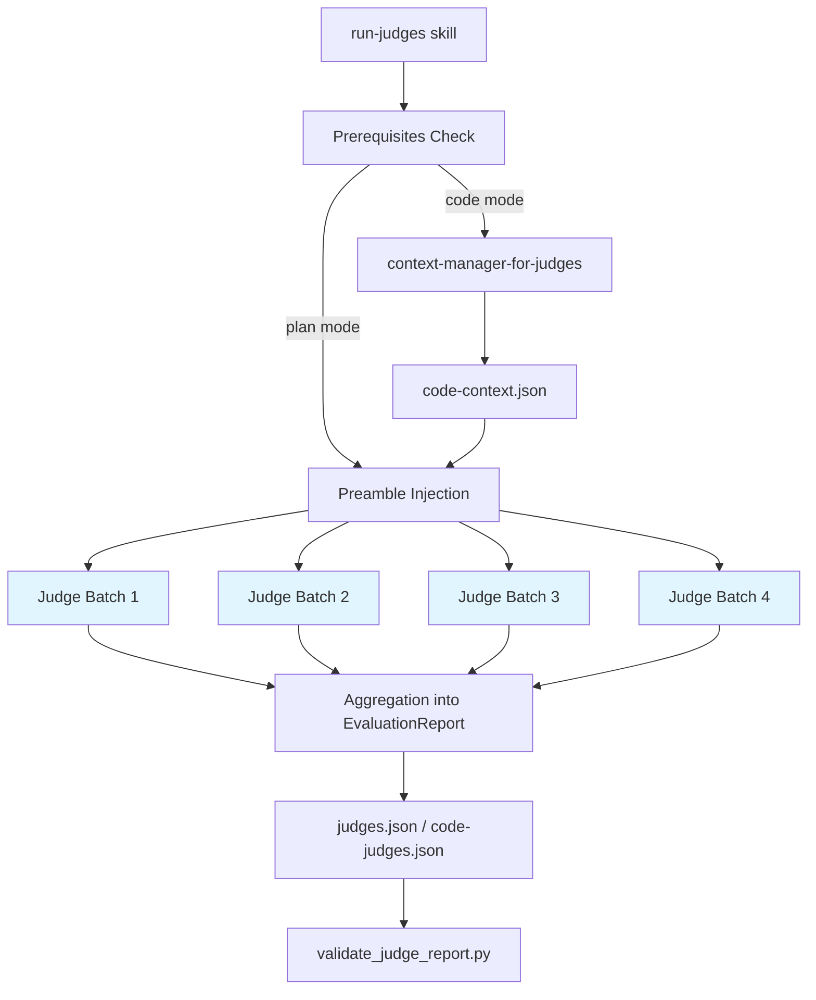

# judges

A collection of specialized LLM judge agents that evaluate implementation plans and code artifacts against software engineering principles and best practices. Judges run in parallel, score artifacts using a structured `CaseScore` JSON schema, and aggregate results into a validation report.

## Features

- **13 plan judges** covering DRY, SSOT, KISS, SOLID principles, code organization, readability, verbosity, goal alignment, test quality, technical accuracy, and custom best practices
- **11 code judges** — the same set minus goal-alignment and verbosity judges, which are plan-specific
- **4 grounding judges** that leverage `investigation-log.md` to verify plan accuracy against actual codebase state (brownfield accuracy, codebase grounding, convention adherence, code review)
- **Parallel execution** via batched Task calls (up to 4 concurrent judges per batch)
- **Structured output** using a validated `CaseScore` JSON schema with Pydantic enforcement
- **Artifact compression** to keep large artifacts within token budgets before judge invocation
- **Evaluation caching** to skip redundant plan evaluations when the plan has not changed
- **Configurable thresholds** via JSON override files at run-level or repo-level
- **Performance telemetry** written to `perf.jsonl` for each pipeline phase

## Architecture Overview



The `eval-cache` skill short-circuits plan evaluation when `plan-evaluation.json` is newer than `plan.json`, avoiding redundant judge runs.

The `artifact-type-tailored-context` skill compresses individual artifact files within a token budget using tiered summarization (full content, intelligent compression, or hard truncation) before passing them to judges.

## Judge Agents

All judges output a `CaseScore` JSON object with:
- `type`: `"case_score"`
- `case_id`: judge identifier
- `final_status`: `1` (pass), `2` (fail/conditional pass), or `3` (error)
- `metrics`: array of scored dimensions with `metric_name`, `threshold`, `score` (0.0 / 0.5 / 1.0), and `justification`

### code-organization-judge

**Evaluates:** File and folder structure from implementation plans.

**Model:** haiku

**Metrics (4):**

| Metric | Threshold | What It Checks |
|--------|-----------|----------------|
| `naming_consistency` | 0.8 | Files and folders follow a single, framework-appropriate naming convention with no mixed styles |
| `module_boundaries` | 0.7 | Each module has one cohesive responsibility with no circular dependencies |
| `separation_of_concerns` | 0.7 | Business logic, data models, repositories, controllers, config, and tests are in distinct locations |
| `navigation_intuitiveness` | 0.75 | A developer familiar with the framework can instantly locate any file |

**Final status:** average score >= 0.75 = pass, >= 0.5 = conditional pass, < 0.5 = fail.

---

### custom-best-practices-judge

**Evaluates:** Code implementation adherence to a caller-supplied best practices document.

**Model:** haiku

**Metrics (5):**

| Metric | Threshold | What It Checks |
|--------|-----------|----------------|
| `practice_adherence` | 0.8 | Code follows all applicable practices in the provided document |
| `pattern_consistency` | 0.7 | Recommended patterns are applied uniformly throughout the code |
| `anti_pattern_avoidance` | 0.8 | Code avoids all anti-patterns listed in the document |
| `completeness` | 0.75 | All relevant practices that apply to this functionality are implemented |
| `quality_impact` | 0.7 | Adherence (or violation) improves (or harms) maintainability and long-term project health |

**Input:** Receives `best_practices` XML block alongside `prompt`, `response`, and `case_id`.

---

### dry-judge

**Evaluates:** Implementation plans for DRY (Don't Repeat Yourself) violations.

**Model:** sonnet

**Reads from `$CLOSEDLOOP_WORKDIR`:** `prd.md` and `plan.json`

**Metrics (1):**

| Metric | Threshold | What It Checks |
|--------|-----------|----------------|
| `dry_score` | 0.8 | Detects duplicated task structures, copy-paste configuration, redundant validation, duplicated tests, repeated transformations, and boilerplate code generation |

**Scoring formula:** Starts at 1.0, applies penalties per violation severity (critical: -0.3, moderate: -0.15, minor: -0.05) and bonuses for proper abstractions (+0.05). Score is clamped to [0.0, 1.0]. Pass threshold is 0.8.

**Supported violation patterns:** Identical task structures (A), copy-paste configuration (B), redundant validation (C), duplicated tests (D), repeated transformations (E), boilerplate code generation (F).

---

### goal-alignment-judge

**Evaluates:** Whether an implementation plan addresses the core business and functional goals expressed in the PRD.

**Model:** sonnet

**Reads from `$CLOSEDLOOP_WORKDIR`:** `prd.md` and `plan.json`

**Metrics (1):**

| Metric | Threshold | What It Checks |
|--------|-----------|----------------|
| `goal_alignment_score` | 0.85 | Each PRD goal component is fully, partially, or not addressed; goal drift (tasks unrelated to any goal) is penalized |

**Scoring formula:** Penalties are applied per unaddressed or partially addressed critical/enhancing goal components, plus an optional goal-drift penalty for plans where more than 30% or 50% of tasks are unrelated to stated goals. Pass threshold is 0.85.

**Used in:** Plan evaluation only (not code evaluation).

---

### kiss-judge

**Evaluates:** Implementation plans for KISS (Keep It Simple) and YAGNI violations.

**Model:** sonnet

**Reads from `$CLOSEDLOOP_WORKDIR`:** `prd.md` and `plan.json`

**Metrics (1):**

| Metric | Threshold | What It Checks |
|--------|-----------|----------------|
| `kiss_score` | 0.8 | Detects premature abstraction, unnecessary layering, speculative features, gold-plating, over-granular tasks, and premature optimization |

**Scoring formula:** Same penalty model as dry-judge (critical: -0.3, moderate: -0.15, minor: -0.05, justified bonus: +0.05). Orphan task ratio (tasks without requirement references) triggers penalties above 10% or 20% thresholds. Pass threshold is 0.8.

---

### readability-judge

**Evaluates:** Implementation plan readability — clarity, structure, language, logical flow, and template adherence.

**Model:** haiku

**Metrics (5):**

| Metric | Threshold | What It Checks |
|--------|-----------|----------------|
| `clarity` | 0.75 | Each task description is unambiguous and specifies exact actions without vague language |
| `structure` | 0.8 | Plan contains all expected sections (Summary, Tasks, Acceptance Criteria) with consistent formatting |
| `language_appropriateness` | 0.75 | Technical terminology is used accurately and consistently for the target audience |
| `logical_flow` | 0.75 | Tasks follow a logical dependency order (setup → implementation → testing) |
| `template_adherence` | 0.8 | Task IDs use the required format (T-1.1, T-1.2) and acceptance criteria are linked (AC-001) |

**Final status:** average score >= 0.75 = pass, >= 0.5 = conditional pass, < 0.5 = fail.

---

### solid-isp-dip-judge

**Evaluates:** Code implementation adherence to the Interface Segregation Principle (ISP) and Dependency Inversion Principle (DIP).

**Model:** haiku

**Metrics (7):**

| Metric | Threshold | What It Checks |
|--------|-----------|----------------|
| `interface_focus` | 0.75 | Interfaces are small and focused; no fat interfaces that bundle unrelated methods |
| `client_specific_interfaces` | 0.75 | Interfaces are designed around client needs, not implementation details |
| `interface_pollution` | 0.8 | No `NotImplementedError`, empty `pass`, or stub implementations indicating forced unused dependencies |
| `dependency_direction` | 0.8 | High-level modules depend on abstractions, not concrete implementations |
| `abstraction_stability` | 0.75 | Abstractions (interfaces, protocols, ABCs) are independent of implementation details |
| `injection_and_composition` | 0.8 | Dependencies are injected via constructor or method parameters, not instantiated directly |
| `coupling_to_concretions` | 0.75 | No direct dependencies on concrete classes where abstractions should be used |

**Final status:** average score >= 0.75 = pass, >= 0.5 = conditional pass, < 0.5 = fail.

---

### solid-liskov-substitution-judge

**Evaluates:** Code implementation adherence to the Liskov Substitution Principle (LSP).

**Model:** haiku

**Metrics (6):**

| Metric | Threshold | What It Checks |
|--------|-----------|----------------|
| `contract_compliance` | 0.8 | Derived classes maintain or strengthen the preconditions and postconditions of base classes |
| `behavioral_consistency` | 0.75 | Any derived instance can substitute for a base class instance without breaking functionality |
| `method_signatures` | 0.8 | Overridden methods are covariant on return types and contravariant on parameter types |
| `exception_handling` | 0.75 | Derived classes only throw exceptions that are the same as or subtypes of base class exceptions |
| `strengthening_weakening` | 0.8 | Preconditions are not strengthened; postconditions are not weakened in derived classes |
| `interface_segregation_relation` | 0.8 | No refused bequest patterns (`NotImplementedError`, empty `pass`) in concrete derived classes |

**Final status:** average score >= 0.75 = pass, >= 0.5 = conditional pass, < 0.5 = fail.

---

### solid-open-closed-judge

**Evaluates:** Code implementation adherence to the Open/Closed Principle (OCP).

**Model:** haiku

**Metrics (5):**

| Metric | Threshold | What It Checks |
|--------|-----------|----------------|
| `extensibility` | 0.8 | Clear extension points exist; new functionality can be added without modifying existing code |
| `abstraction_use` | 0.75 | Dependencies are on abstractions rather than concrete implementations |
| `design_patterns` | 0.75 | Appropriate patterns (Strategy, Template Method, Plugin, Factory) are used to support extension |
| `modification_risk` | 0.8 | Adding new features does not require modifying existing tested code |
| `conditional_logic` | 0.8 | No rigid if/else chains or switch statements that need modification when adding new cases |

**Final status:** average score >= 0.75 = pass, >= 0.5 = conditional pass, < 0.5 = fail.

---

### ssot-judge

**Evaluates:** Implementation plans for SSOT (Single Source of Truth) violations.

**Model:** sonnet

**Reads from `$CLOSEDLOOP_WORKDIR`:** `prd.md` and `plan.json`

**Metrics (1):**

| Metric | Threshold | What It Checks |
|--------|-----------|----------------|
| `ssot_score` | 0.8 | Detects scattered or duplicated definitions of configuration, data schemas, business rules, API contracts, UI constants, and state machines across tasks |

**Truth categories:** Configuration, data schemas, business rules, API contracts, UI constants, state machines.

**Centralization patterns:** Centralized (good, +0.05 bonus), no central source (violation), partial centralization, competing sources. Legitimate duplication (e.g., frontend + backend validation with explicit sync task) is excluded from penalties.

**Scoring formula:** Same penalty model (critical: -0.3, moderate: -0.15, minor: -0.05, justified: +0.05). Pass threshold is 0.8.

---

### technical-accuracy-judge

**Evaluates:** Technical accuracy of AI assistant responses including API usage, language features, and algorithmic concepts.

**Model:** haiku

**Metrics (4):**

| Metric | Threshold | What It Checks |
|--------|-----------|----------------|
| `api_correctness` | 0.8 | Function names, parameter names, types, imports, and behavior match real documented APIs |
| `language_feature_accuracy` | 0.8 | Language constructs, syntax, semantics, and type systems are used and described correctly |
| `algorithm_complexity_accuracy` | 0.8 | Big-O notation, time/space complexity analysis, and data structure characteristics are factually correct |
| `terminology_accuracy` | 0.8 | Technical vocabulary is used according to standard definitions without conflation of distinct concepts |

**Final status:** average score >= 0.75 = pass, >= 0.5 = conditional pass, < 0.5 = fail.

---

### test-judge

**Evaluates:** Test code quality including coverage, assertions, structure, and best practices.

**Model:** haiku

**Metrics (4):**

| Metric | Threshold | What It Checks |
|--------|-----------|----------------|
| `test_coverage` | 0.7 | Critical happy paths, edge cases (boundary values, empty inputs, null), and error scenarios are tested |
| `assertion_quality` | 0.7 | Assertions validate specific expected values, not just existence; side effects are validated when relevant |
| `test_structure` | 0.7 | Tests follow Arrange-Act-Assert or Given-When-Then; names are descriptive; tests are isolated |
| `testing_best_practices` | 0.7 | Appropriate test type for the scenario; mocking is targeted at external dependencies only; no flakiness |

**Note:** The default threshold for `test-judge` in code evaluation mode is 0.75 (lowered from 0.8) to account for incremental test development.

---

### verbosity-judge

**Evaluates:** Whether an implementation plan's verbosity is appropriately calibrated to the problem's complexity.

**Model:** haiku

**Metrics (3):**

| Metric | Threshold | What It Checks |
|--------|-----------|----------------|
| `length_appropriateness` | 0.7 | Plan length matches complexity (LOW = concise, MEDIUM = structured, HIGH = comprehensive) |
| `value_density` | 0.7 | Every section adds actionable implementation value; no repetition, filler, or irrelevant background |
| `detail_balance` | 0.7 | Complex/non-obvious areas receive more detail; standard practices are kept brief |

**Used in:** Plan evaluation only (not code evaluation).

---

### brownfield-accuracy-judge

**Evaluates:** How accurately an implementation plan accounts for existing code — correctly identifying what to modify vs create, avoiding reimplementation, and finding the right integration points.

**Model:** opus

**Reads from `$CLOSEDLOOP_WORKDIR`:** `investigation-log.md`, `plan.json`, `prd.md`

**Metrics (3):**

| Metric | Threshold | What It Checks |
|--------|-----------|----------------|
| `reuse_vs_reimplement` | 0.8 | Plan reuses existing code where investigation-log confirms it exists, rather than reimplementing |
| `integration_point_accuracy` | 0.8 | Proposed integration points (function calls to modify, files to extend) are confirmed correct by investigation-log |
| `scope_accuracy` | 0.8 | Plan correctly scopes what needs to change — neither missing required changes nor touching unrelated code |

**Investigation-log dependency:** If `investigation-log.md` is absent, all metrics score 0.5 with `final_status = 2` (FAIL — unverifiable).

---

### codebase-grounding-judge

**Evaluates:** Whether an implementation plan is grounded in codebase reality by comparing plan claims against the investigation log. Detects hallucinated file paths, nonexistent modules, and fabricated APIs.

**Model:** opus

**Reads from `$CLOSEDLOOP_WORKDIR`:** `investigation-log.md`, `plan.json`, `prd.md`

**Metrics (3):**

| Metric | Threshold | What It Checks |
|--------|-----------|----------------|
| `file_path_accuracy` | 0.8 | File paths in the plan are confirmed by investigation-log or structurally consistent with it |
| `module_reference_accuracy` | 0.8 | Module, class, function, and API references match investigation-log ground truth |
| `existing_code_awareness` | 0.8 | Plan correctly identifies what already exists vs what needs to be built |

**Investigation-log dependency:** If `investigation-log.md` is absent, all metrics score 0.5 with `final_status = 2` (FAIL — unverifiable). The judge does not access the filesystem directly.

---

### convention-adherence-judge

**Evaluates:** Whether an implementation plan follows the conventions, patterns, and style found in the actual codebase, as documented in the investigation log.

**Model:** sonnet

**Reads from `$CLOSEDLOOP_WORKDIR`:** `investigation-log.md`, `plan.json`, `prd.md`

**Metrics (3):**

| Metric | Threshold | What It Checks |
|--------|-----------|----------------|
| `naming_convention_compliance` | 0.8 | Proposed names (files, classes, functions) follow conventions documented in investigation-log |
| `structural_convention_compliance` | 0.8 | Proposed file locations and module organization follow the project's structure |
| `pattern_and_tooling_compliance` | 0.8 | Proposed code patterns and tools match what the project uses |

**Investigation-log dependency:** If `investigation-log.md` is absent, all metrics score 0.5 with `final_status = 2` (FAIL — unverifiable).

---

### code-review-judge

**Evaluates:** Implementation quality by running the code review pipeline (code_review_helpers.py + code-review-worker agents) and translating findings into a CaseScore.

**Model:** sonnet

**Reads from `$CLOSEDLOOP_WORKDIR`:** `plan.json`, `investigation-log.md` (optional)

**Metrics (4):**

| Metric | Threshold | What It Checks |
|--------|-----------|----------------|
| `security_score` | 0.7 | Security findings from code review pipeline |
| `correctness_score` | 0.7 | Correctness, type safety, and async findings |
| `performance_score` | 0.7 | Performance findings |
| `code_quality_score` | 0.7 | Code quality, DRY, repo hygiene, and convention findings |

**Scoring:** Starts at 1.0 per metric, applies severity-based penalties (BLOCKING: -0.35, HIGH: -0.20, MEDIUM: -0.08, LOW: -0.02). Falls back to manual review if code_review_helpers.py is unavailable.

**Used in:** Code evaluation only.

---

## Grounding Judges and investigation-log.md

The four grounding judges (brownfield-accuracy, codebase-grounding, convention-adherence, code-review) use `investigation-log.md` as ground truth to verify plan quality against the actual codebase. This investigation log is produced during pre-exploration and documents real files, modules, conventions, and integration points.

**Key design decisions:**
- If `investigation-log.md` is absent, grounding judges score all metrics at 0.5 and return `final_status = 2` (FAIL — unverifiable) rather than attempting to evaluate
- These judges do not access the filesystem directly (except code-review-judge for git diffs); they rely solely on the investigation log
- They are the primary differentiators between plans written with codebase context (ClosedLoop) and plans written blind (OOTB)

---

## Tools

### Benchmarks (`tools/python/benchmarks/`)

E2E benchmark pipeline for measuring judge quality and performance.

- **score_report.py** — Parses judge reports, computes per-judge mean scores, compares against baselines, checks thresholds, and generates markdown reports for PR comments. Supports 3-tier comparison (OOTB model vs ClosedLoop main vs current PR).
- **test_benchmarks.py** — Deterministic pytest suite validating fixture integrity, token usage, artifact quality, and performance event analysis against `thresholds.json`.
- **perf_summary.py** — Performance telemetry analysis tool that summarizes iterations, pipeline steps, sub-steps, and agent timings from `perf.jsonl`.

---

## Skills

### run-judges

Orchestrates parallel judge agent execution, aggregates `CaseScore` results, and validates output.

**Parameters:**
- `--artifact-type`: `plan` (default) or `code`

**Plan mode** (default):
- Reads `prd.md` and `plan.json` from `$CLOSEDLOOP_WORKDIR`
- Runs 13 judges in 4 sequential batches (max 4 concurrent per batch)
- Writes `$CLOSEDLOOP_WORKDIR/judges.json`

**Code mode** (`--artifact-type code`):
- Launches `context-manager-for-judges` agent to produce `code-context.json`
- Prepends `code_preamble.md` to each judge prompt
- Runs 11 judges in 3 sequential batches
- Writes `$CLOSEDLOOP_WORKDIR/code-judges.json`

**Threshold overrides** are loaded from (in order of precedence):
1. `$CLOSEDLOOP_WORKDIR/.claude/settings/threshold-overrides.json`
2. `<project-root>/.claude/settings/threshold-overrides.json`
3. Built-in defaults

**Output validation** is run after writing the report using `scripts/validate_judge_report.py`. The skill retries until validation passes.

---

### artifact-type-tailored-context

Compresses individual artifact files within a token budget before judge invocation. Runs in a forked context to avoid polluting the parent agent's context window.

**Parameters:** `artifact_path`, `task_description`, `token_budget`

**Compression tiers:**
1. **Full content** — artifact fits within budget; returned unchanged
2. **Intelligent compression** — artifact is 1x–1.5x the budget; applies artifact-type-specific summarization (code diffs preserve function signatures, JSON arrays are truncated, log files keep errors/warnings, plan markdown keeps headings and code blocks)
3. **Hard truncation** — artifact exceeds 1.5x the budget; truncated at paragraph boundary with a `[TRUNCATED]` marker

**Returns:** JSON with `artifact_name`, `raw_tokens`, `compacted_tokens`, `truncated`, and `content`.

---

### eval-cache

Checks for a cached plan evaluation result before launching the plan-evaluator agent.

**When to use:** At the start of Phase 1.3 (Simple Mode Evaluation), before launching `@code:plan-evaluator`.

**Freshness check:** Compares modification timestamps of `plan-evaluation.json` and `plan.json`. If `plan.json` is newer, returns `EVAL_CACHE_MISS`; otherwise returns `EVAL_CACHE_HIT` with cached `simple_mode`, `selected_critics`, and `summary`.

---

## Usage

### Evaluating an Implementation Plan

1. Ensure `$CLOSEDLOOP_WORKDIR/prd.md` and `$CLOSEDLOOP_WORKDIR/plan.json` exist.
2. Invoke the `run-judges` skill (default artifact type is `plan`):

```
@judges:run-judges
```

3. Results are written to `$CLOSEDLOOP_WORKDIR/judges.json`.

### Evaluating Implemented Code

1. Ensure code artifacts (git diff, changed files, build results) are available in `$CLOSEDLOOP_WORKDIR`.
2. Invoke the `run-judges` skill with the code artifact type:

```
@judges:run-judges --artifact-type code
```

3. The skill runs `context-manager-for-judges` first to produce `code-context.json`, then launches 11 judges.
4. Results are written to `$CLOSEDLOOP_WORKDIR/code-judges.json`.

### Configuring Threshold Overrides

Create a JSON file at `$CLOSEDLOOP_WORKDIR/.claude/settings/threshold-overrides.json` (run-specific) or `<project-root>/.claude/settings/threshold-overrides.json` (repo-wide):

```json
{
  "overrides": {
    "code:test-judge": 0.75,
    "plan:technical-accuracy-judge": 0.85
  }
}
```

Key format: `"artifact_type:judge_name"`. Valid artifact types: `plan`, `code`.

### Output Format

Each judge produces a `CaseScore`:

```json
{
  "type": "case_score",
  "case_id": "dry-judge",
  "final_status": 1,
  "metrics": [
    {
      "metric_name": "dry_score",
      "threshold": 0.8,
      "score": 0.9,
      "justification": "No duplication detected. T-2.1 creates a shared auth utility used by T-3.1, T-3.2, and T-3.3."
    }
  ]
}
```

The aggregated report (`judges.json` or `code-judges.json`) wraps all `CaseScore` objects:

```json
{
  "report_id": "{RUN_ID}-judges",
  "timestamp": "2024-02-03T15:45:30Z",
  "stats": [ ... ]
}
```
