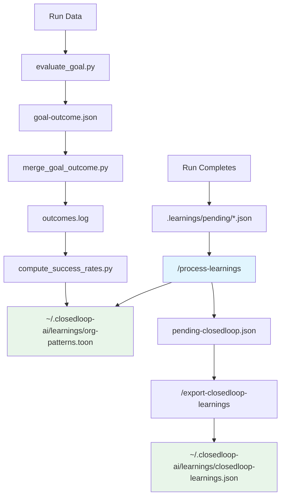

# Self-Learning Plugin

A ClosedLoop plugin that enables AI agents to learn from their mistakes and successes across runs, accumulating organizational knowledge in a persistent pattern store that improves agent behavior over time.

## Overview

The self-learning plugin captures learnings from ClosedLoop agent runs, validates and deduplicates them, and merges them into a global knowledge base (`org-patterns.toon`). Patterns are tracked with success rates, confidence levels, and staleness flags so that high-performing patterns are promoted and ineffective ones are pruned automatically.

The plugin also provides goal-oriented evaluation: each run is measured against a configurable goal (e.g., minimize iterations, pass tests, reduce tokens), and goal outcomes feed back into pattern success rate calculations.

## Key Features

- **Automatic learning capture**: Agents write pending learnings to `.learnings/pending/` as JSON files during runs.
- **Validation pipeline**: Learnings are classified by scope and category, then vetted for factual accuracy, generalizability, and clarity before being accepted.
- **Deduplication**: Exact trigger matches and summaries with 80%+ word overlap are merged rather than duplicated.
- **TOON format storage**: Patterns are stored in Token-Oriented Object Notation, a compact format with ~40% token reduction compared to JSON, optimized for LLM context injection.
- **Deterministic success rates**: Pattern effectiveness is computed from `outcomes.log` data, not by LLM estimation.
- **Goal-weighted scoring**: Pattern success rates can be weighted by whether the run achieved its configured goal.
- **Organization-wide sharing**: Patterns can be pushed to and pulled from a shared team repository.
- **Automated pruning**: Old sessions, large log files, and archived pending files are cleaned up on a configurable retention schedule.

## Architecture Overview



Patterns flow from individual agent runs up to the global `org-patterns.toon`, then optionally to a shared organization repository via `push-learnings` and `pull-learnings`.

## Commands

All commands are invoked through the ClosedLoop orchestrator using the `self-learning:` prefix.

### `/process-learnings [workdir]`

The primary command. Processes pending learnings from a ClosedLoop run into the global `org-patterns.toon`.

**Steps:**
1. Locates pending learning files in `$CLOSEDLOOP_WORKDIR/.learnings/pending/`
2. Rescues stray learnings written to the project root instead of the workdir
3. Classifies each learning by scope (`closedloop` or `organization`) and category (`mistake`, `pattern`, `convention`, `insight`), and assigns `repo_scope` (`*` for generalizable, or a specific repo name)
4. Validates learnings for factual accuracy, correct scope, clarity, and generalizability — rewording or rejecting problematic entries
5. Merges approved learnings into `~/.closedloop-ai/learnings/org-patterns.toon` with deduplication
6. Prunes low-performing patterns (flags patterns with <20% success over 5+ applications, removes patterns with 0% success over 10+ applications)
7. Extracts ClosedLoop-specific learnings to `pending-closedloop.json`
8. Reports a summary of processed, rejected, scoped, and pruned patterns

**Usage:**
```bash
/process-learnings /path/to/closedloop-workdir
/process-learnings   # defaults to current directory
```

### `/export-closedloop-learnings [workdir]`

Merges ClosedLoop-specific pending learnings into the global `~/.closedloop-ai/learnings/closedloop-learnings.json` with deduplication. Typically invoked automatically after each loop iteration.

**Deduplication:**
- Exact `trigger` match: skip
- 80%+ word overlap on `summary`: skip
- Otherwise: assign new sequential `SL-{N}` ID and append

**Usage:**
```bash
/self-learning:export-closedloop-learnings $WORKDIR
```

### `/push-learnings`

Exports local organization patterns to a shared repository for team-wide distribution. Requires `CLAUDE_ORG_ID` environment variable. Handles ID collision resolution and tracks source project metadata in `sources.json`.

### `/pull-learnings`

Imports organization patterns from a shared repository into the local TOON format. Prevents circular propagation by skipping patterns that originated from the current project (echo prevention). Requires `CLAUDE_ORG_ID` and a prior `git pull` to fetch the latest shared patterns.

### `/prune-learnings`

Manually invokes the pruning script to clean up old data. Pruning also runs automatically after each completed run.

**What gets pruned:**
- Session directories beyond the `max_sessions` limit (oldest first)
- Log files rotated when exceeding `max_log_lines`
- Archived pending files older than `max_archive_age_days`
- Stale lock files older than `lock_stale_hours`

### `/goal-stats`

Analyzes goal performance by reading `runs.log` and `outcomes.log`. Reports pass rate, average score, top contributing patterns, underperforming patterns, and improvement trends over time. Requires at least 5 runs for meaningful statistics.

## Skills

### `self-learning:toon-format`

Provides syntax rules, quoting conventions, and examples for TOON (Token-Oriented Object Notation), the storage format for `org-patterns.toon`.

**Key rules:**
- Tabular arrays: `patterns[N]{field1,field2,...}:` followed by rows indented with exactly 2 spaces
- The `summary` field is always quoted (natural language contains commas)
- Pipe-separated values within fields for multi-value fields (`applies_to`, `context`)
- `repo` field uses repository name or `*` for all repos
- Flags: `[REVIEW]`, `[STALE]`, `[UNTESTED]`, `[PRUNE]`

**Example:**
```toon
patterns[2]{id,category,summary,confidence,seen_count,success_rate,flags,applies_to,context,repo}:
  P-001,pattern,"Always check token expiry before API calls",high,5,0.85,,implementation-subagent,auth|API,*
  P-002,mistake,"Check for None before accessing optional dict keys",medium,3,0.60,[REVIEW],*,python|safety,astoria-frontend
```

### `self-learning:learning-quality`

Provides a decision tree and workflow for agents to determine when and how to capture learnings during runs. Includes hard rejection criteria, scope classification (project vs. global), and a formula for writing actionable patterns.

**Capture decision tree:**
1. Did I make a mistake or discover something non-obvious? (No = skip)
2. Is it a config value like a specific URL or file path? (Yes = write to CLAUDE.md, not org-patterns)
3. Is it tied to a single feature with no generalizable principle? (Yes = skip)
4. Will it still be true in 6 months? (No = skip or generalize)
5. Does it already exist? (Yes = skip)
6. Otherwise: capture it

## Schemas

### `schemas/learning.schema.json`

JSON Schema (draft-07) for classified learning files produced during `/process-learnings`.

**Required fields:**
- `schema_version` — always `"1.0"`
- `run_id` — format `YYYYMMDD-HHMMSS`
- `iteration` — integer >= 1
- `captured_at` — ISO 8601 timestamp
- `learnings` — array of learning objects

**Learning object required fields:**
- `id` — pattern `L-{3+ digits}`
- `scope` — `"closedloop"` or `"organization"`
- `category` — `"mistake"`, `"pattern"`, `"convention"`, or `"insight"`
- `trigger` — 3–50 character short phrase used for pattern matching
- `summary` — 20–200 character actionable description
- `confidence` — `"high"`, `"medium"`, or `"low"`

### `schemas/goal.schema.json`

JSON Schema (draft-07) for `goal.yaml`, which configures the active learning objective.

**Structure:**
- `active_goal` — name of the currently active goal
- `goals` — map of goal names to goal configurations

**Goal configuration:**
- `description` — human-readable description (required)
- `pattern_priority` — ordered list of category types to prioritize
- `success_criteria` — either threshold (metric + target + direction) or binary (test command)
- `metrics` — list of metric names to track

**Built-in goals:** `reduce-failures`, `swe-bench`, `minimize-tokens`, `maximize-coverage`

## Scripts

### `scripts/bootstrap-learnings.sh`

Initializes the learning system directory structure for a new project or run.

**Creates:**
- `.learnings/pending/archived/` and `.learnings/sessions/` directories
- `org-patterns.toon` — empty pattern store with TOON header
- `goal.yaml` — default goal configuration with built-in goals
- `retention.yaml` — pruning configuration with sensible defaults
- `.gitignore` — excludes ephemeral data (sessions, pending, logs) while keeping shareable files (org-patterns.toon, goal.yaml, retention.yaml)

**Usage:**
```bash
./plugins/self-learning/scripts/bootstrap-learnings.sh
./plugins/self-learning/scripts/bootstrap-learnings.sh /tmp/run/.learnings
```

### `scripts/prune-learnings.sh`

Cleans up old sessions, rotates large log files, and removes stale archived files according to `retention.yaml`. Respects active lock files and protects runs active within the last 30 minutes (configurable).

**Reads:** `$CLOSEDLOOP_WORKDIR/.learnings/retention.yaml`
**Operates on:** `sessions/`, `runs.log`, `outcomes.log`, `acknowledgments.log`, `pending/archived/`

### `scripts/process-chat-learnings.sh`

Lightweight wrapper invoked when a chat session ends. Checks for pending learnings and calls `/self-learning:process-learnings` via the Claude CLI if any are found. Writes status to `.learnings/processing-status.json`.

**Usage:**
```bash
./plugins/self-learning/scripts/process-chat-learnings.sh <workdir>
```

### `scripts/preflight-check.sh`

Validates all required and optional dependencies before using the self-learning system.

**Required:** Python 3.11+, jq, awk, git, PyYAML
**Optional:** tree-sitter, tree-sitter-python (for AST-based analysis)

**Exit codes:** 0 = all OK, 1 = missing required, 2 = missing optional

## Python Tools

All tools are in `tools/python/` and require Python 3.11+. Install dependencies with:

```bash
pip install -r tools/python/requirements.txt
```

Dependencies: `pyyaml>=6.0`

### `compute_success_rates.py`

Reads `outcomes.log` and updates `org-patterns.toon` with deterministic success rates, confidence levels, and flags.

**Matching strategy (tiered):** exact -> case-insensitive -> substring -> Jaccard similarity > 0.6

**Success rate modes:**
- Simple: `applied / total` (excluding `|unverified` entries)
- Goal-weighted: `goal_success=1` contributes full weight; `goal_success=0` contributes `relevance_score * 0.5`

**Confidence thresholds:** high >= 0.70, medium >= 0.40, low < 0.40
**Flag assignment:** `[PRUNE]` if > 20 applications and < 40% success; `[STALE]` if no application in last 10 iterations; `[REVIEW]` if success rate < 40%; `[UNTESTED]` if no applications found

**Usage:**
```bash
python3 compute_success_rates.py --workdir /path/to/workdir [--toon-file /path/to/org-patterns.toon] [--dry-run]
```

### `evaluate_goal.py`

Evaluates a run's outcome against the configured goal and writes the result to `.learnings/goal-outcome.json`.

**Built-in evaluators:**
- `reduce-failures`: measures iteration count against target
- `swe-bench`: runs a test command and parses pass/fail counts
- `minimize-tokens`: reads Claude session JSONL for token usage
- `maximize-coverage`: placeholder (returns 0.5)
- Custom: invokes `GOAL_EVALUATOR_SCRIPT` environment variable

**Usage:**
```bash
python3 evaluate_goal.py --workdir /path/to/workdir --run-id 20240115-103000 [--goal swe-bench] [--output result.json]
```

### `goal_config.py`

Loads and validates `goal.yaml` with full error handling. All failures degrade gracefully to the default `reduce-failures` goal. Provides `load_goal_config()` and `get_pattern_priority_safe()` for use by other tools.

**Usage:**
```bash
python3 goal_config.py --workdir /path/to/workdir [--goal swe-bench] [--json]
```

### `pattern_relevance.py`

Calculates relevance scores for patterns against a list of changed files using context tag extraction and keyword overlap. Scores range from 0.0 to 1.0 and are used to weight pattern success rates in goal-failure scenarios.

**Usage:**
```bash
python3 pattern_relevance.py --workdir /path/to/workdir --changed-files changed.json [--output scores.json]
```

### `merge_goal_outcome.py`

Appends goal result fields (`goal_name|goal_success|goal_score`) to matching `outcomes.log` entries for a given `run_id`. Enables `compute_success_rates.py` to use goal-weighted scoring.

**Usage:**
```bash
python3 merge_goal_outcome.py --workdir /path/to/workdir [--outcome-file result.json]
```

### `merge_relevance.py`

Appends relevance score fields (`relevance_score|relevance_method`) to `outcomes.log` entries. Uses pattern ID matching to correlate relevance scores from `pattern_relevance.py` with log entries.

**Usage:**
```bash
python3 merge_relevance.py --workdir /path/to/workdir --relevance-file scores.json
```

### `merge_build_result.py`

Reads `build-result.json` and appends `|build_passed` or `|build_failed` to `outcomes.log` entries for `implementation-subagent` patterns in the current iteration. Lets the success rate calculation incorporate build validation results.

**Usage:**
```bash
python3 merge_build_result.py --workdir /path/to/workdir
```

### `verify_citations.py`

Verifies that learning acknowledgments contain valid `file:line` citations corresponding to actual changes in the git diff. Invalid citations are marked `|unverified` in `outcomes.log` and excluded from success rate calculations.

**Usage:**
```bash
python3 verify_citations.py --start-sha <git-sha> --workdir /path/to/workdir
```

### `perf_summary.py`

Reads `perf.jsonl` and prints timing tables for iterations, pipeline steps, sub-steps, and agents. Useful for identifying bottlenecks in the ClosedLoop loop.

**Usage:**
```bash
python3 perf_summary.py --workdir /path/to/workdir [--run-id 20240115-103000] [--format text|json]
```

### `write_merged_patterns.py`

Reads `merge-result.json` (produced by `/process-learnings`) and writes it to `org-patterns.toon` using deterministic TOON serialization. Separates LLM reasoning (dedup, validation, merge) from the mechanical serialization step. Validates all patterns before writing, sorts by confidence and flags priority, and enforces a 50-pattern cap. Creates a `.bak` backup before overwriting and uses atomic write (`.tmp` then rename).

**Usage:**
```bash
python3 write_merged_patterns.py --merge-result /path/to/merge-result.json [--toon-path /path/to/org-patterns.toon] [--dry-run]
```

## Directory Structure

```
$CLOSEDLOOP_WORKDIR/.learnings/
  pending/               # Raw JSON learnings from agents (ephemeral)
    archived/            # Processed pending files (pruned after max_archive_age_days)
  sessions/              # Classified learning files per run (pruned after max_sessions)
    run-{ID}/
      iter-{N}.json
  org-patterns.toon      # Shared pattern store (committed to version control)
  goal.yaml              # Goal configuration (committed)
  retention.yaml         # Pruning policy (committed)
  outcomes.log           # Pattern application records (local only)
  runs.log               # Run metadata (local only)
  acknowledgments.log    # Agent acknowledgment records (local only)
  goal-outcome.json      # Latest goal evaluation result (local only)
  pending-closedloop.json # ClosedLoop-specific learnings pending export

~/.closedloop-ai/learnings/
  org-patterns.toon      # Global cross-project pattern store
  closedloop-learnings.json  # ClosedLoop framework learnings
```

## Usage

### Initial Setup

```bash
# Check dependencies
./plugins/self-learning/scripts/preflight-check.sh

# Initialize learning system in a project
./plugins/self-learning/scripts/bootstrap-learnings.sh
```

### During Runs

Agents write learnings automatically to `.learnings/pending/` using the format defined by the `learning-quality` skill. After each run, the orchestrator invokes `/process-learnings` to process pending files.

### Manual Processing

```bash
# Process learnings from a specific run directory
/process-learnings /path/to/closedloop-workdir

# View goal performance statistics
/goal-stats

# Clean up old data manually
/prune-learnings

# Sync with team (requires CLAUDE_ORG_ID)
export CLAUDE_ORG_ID="my-organization"
git pull origin main
/pull-learnings
/push-learnings
```

### Configuring Goals

Edit `.learnings/goal.yaml` to set the active goal and success criteria:

```yaml
active_goal: swe-bench

goals:
  swe-bench:
    description: "Pass SWE-bench test cases"
    pattern_priority:
      - mistake
      - pattern
    success_criteria:
      type: binary
      test_command: "pytest tests/ -x"
    metrics:
      - tests_passed
      - tests_failed
```

### Configuring Retention

Edit `.learnings/retention.yaml` to adjust pruning behavior:

```yaml
max_runs: 100
max_sessions: 50
max_log_lines: 10000
max_archive_age_days: 30
lock_stale_hours: 4
protected_window_minutes: 30
```
